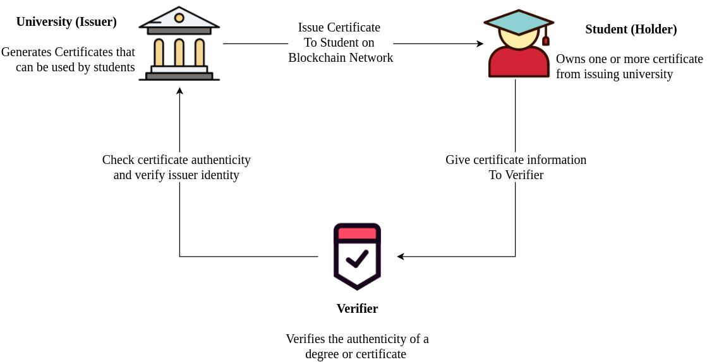
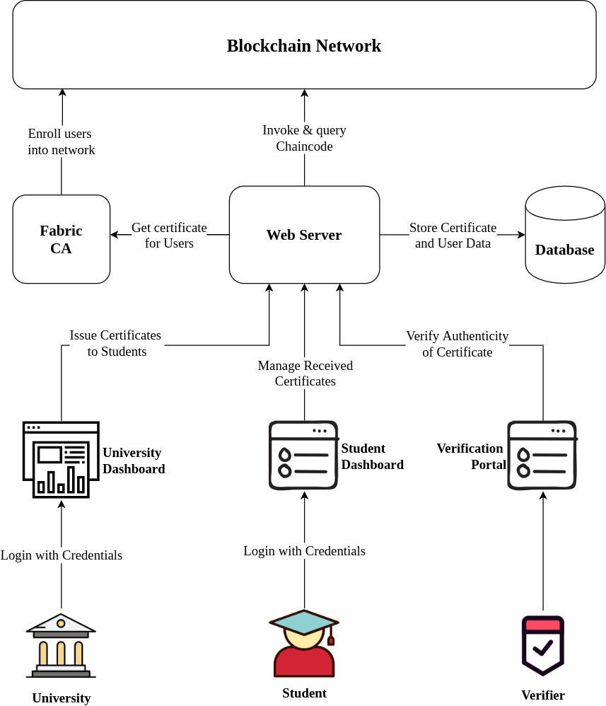

# Academic Certificates on the Blockchain

The academic certificate verification platform using blockchain technology is used to issue, manage and verify academic certificates in a secure and distributed manner. This project addresses the need for a secure digital platform to issue and verify academic certificates without intervention from the original certificate issuer (University).



The core functionality of this application are :
* Create and issue academic certificates.
* Manage and share academic certificates.
* Verify authenticity of shared certificates.

## Architecture Overview


The following technologies are used on the application
* **[Hyperledger Fabric](https://www.hyperledger.org/use/fabric)**: Used to build the blockchain network, run smart contracts. Fabric CA is used to enroll members in the network. 
* **[Node.js](https://nodejs.org/en/)**: Backend of the web application is built in nodeJS runtime using the express framework. Chaincode is also written in NodeJS.
* **[MongoDB](https://www.mongodb.com/)**: The user and certificate data is stored in MongoDB database. 
* **[Bootstrap](https://getbootstrap.com/)**: The front-end of the web application is built using bootstrap, ejs & jQuery.

## Network Users

The users of the platform include - Universities, Students and Certificate Verifiers (Eg - Employers). The actions that can be performed by each party are as follows

**Universities**
* Issue academic certificates.
* View academic certificates issued. 
* Endorse Verification and digitally sign academic certificates.

**Students**
* Receive academic certificates from universities.
* View and manage received academic certificates.
* Share academic certificates with third party verifiers.
* Selective disclosure of certificate data.

**Verifier**
* Receive certificate data from students.
* Verify certificate authenticity with blockchain platform.

To learn more about how selective disclosure and decentralized verifications work, read about [verifiable credentials](https://en.wikipedia.org/wiki/Verifiable_credentials).


## Getting Started

**IMPORTANT NOTE:** The instructions for building this project are out of date. I'm unfortunately not in a position right now to test and update these instructions. If you're able to get the project up and running properly. a pull request to update the following instructions is appreciated! 

Related Issue: [#4](https://github.com/TasinIshmam/blockchain-academic-certificates/issues/4) 

#### Prerequisites

In order to install the application, please make sure you have the following installed with the same major version number.

1) Hyperledger fabric version 2.1.x.  

2) Node version 12.x.  

3) MongoDB version 4.0.x    

4) Latest version of NPM package manager  


#### Starting Fabric Network

1) Clone the repo
    ```sh
    git clone https://github.com/TasinIshmam/blockchain-academic-certificates.git
    ```
2) Start the fabric test-network with couchdb
    ```sh
    # at fabric-samples
    
    cd test-network
    ./network.sh up createChannel -ca -c mychannel -s couchdb
    ```
3) Package the chaincode situated in the chaincode directory.  
    1) Follow the instructions [here](https://hyperledger-fabric.readthedocs.io/en/release-2.2/deploy_chaincode.html#javascript)
    2) **Note**: Make sure in the final package instruction to name the package appropriately. By default it's named fabcar_1 
    
4) Install the chaincode according to the instructions [here](https://hyperledger-fabric.readthedocs.io/en/release-2.1/deploy_chaincode.html#install-the-chaincode-package).(I'm referencing the instructions for Fabric version 2.1, please switch to the docs of your appropriate installed version).   


#### Starting Web Application
Make sure mongodb and fabric network are running in the background before starting this process. 

1) Go to web-app
    ```sh
    # at blockchain-academic-certificates
    cd web-app
    ```
2) Install all modules
    ```sh 
   npm install
   npm install --only=dev  # For dev dependencies
    ```
3) Create .env file
    ``` 
    touch .env 
    ```
4) Specify environment variables in .env file.
    1) Specify ```MONGODB_URI_LOCAL``` to your mongodb database.
    2) Specify ```EXPRESS_SESSION_SECRET``` as a long random secret string.
    3) Specify ```CCP_PATH``` as the connection profile of org1 in your test network. The path for this should be ```~/fabric-samples/test-network/organizations/peerOrganizations/org1.example.com/connection-org1.json```  
    4) In ```FABRIC_CHANNEL_NAME``` and ```FABRIC_CHAINCODE_NAME``` specify the channel and chaincode label respectively used during fabric network installation.
    5) Sample .env file
        ```dotenv
        MONGODB_URI_LOCAL = mongodb://localhost:27017/blockchaincertificate
        PORT = 3000
        LOG_LEVEL = info
        EXPRESS_SESSION_SECRET = sdfsdfddfgdfg3242efDFHI234 
        CCP_PATH = /home/tasin/fabric-samples/test-network/organizations/peerOrganizations/org1.example.com/connection-org1.json
        FABRIC_CHANNEL_NAME = mychannel
        FABRIC_CHAINCODE_NAME = fabcar_1
        ```
5) Start the server in development mode
    ```sh
    npm run start-development
    ```


Project Link: [https://github.com/TasinIshmam/blockchain-academic-certificates](https://github.com/TasinIshmam/blockchain-academic-certificates)


